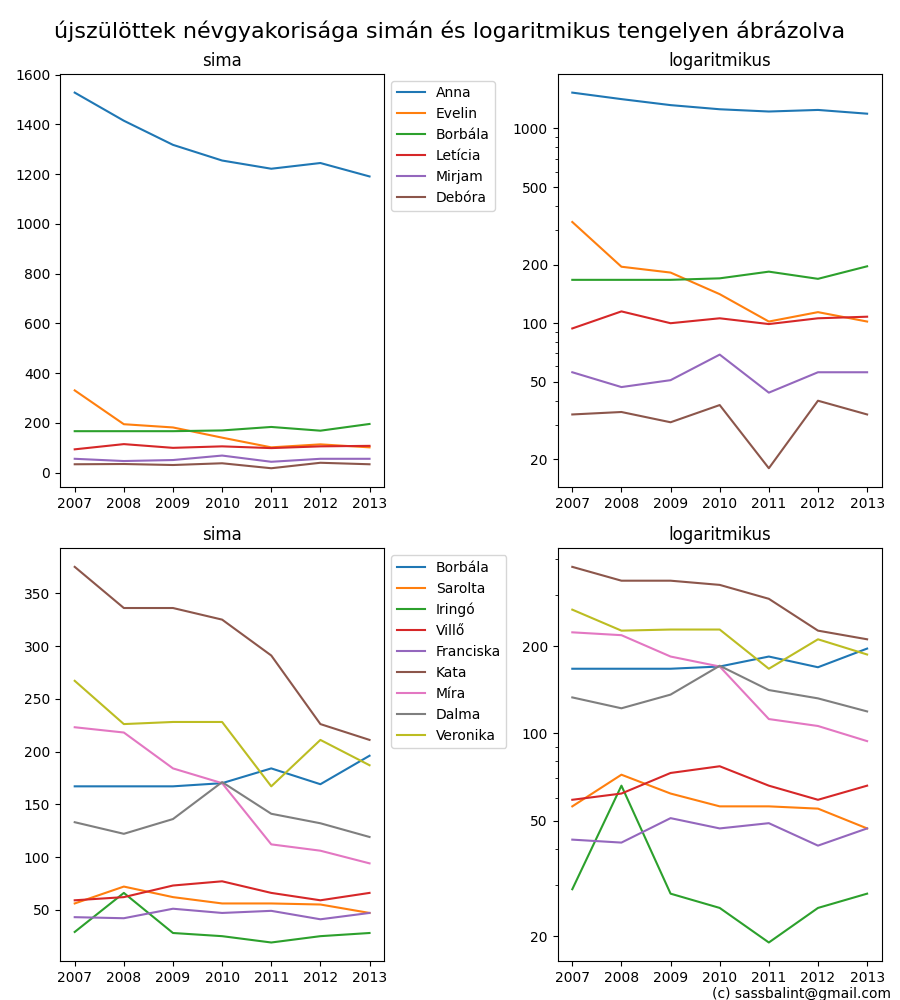

# teach-logarithm

Mire jó a logaritmikus tengely?

Arra, hogy jobban látszódjanak a dolgok a grafikonon,
vagyishát egyáltalán _bármi_ látszódjon,
ha több/sok nagyságrendet ölelnek fel az értékek.

Tipikusan ilyen több nagyságrendet felölelő adat a keresztnevek gyakorisága.

